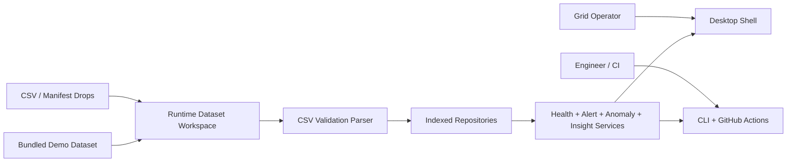

# Architecture Deep Dive

## Goals

The repository is designed around four goals:

1. Keep core telemetry and alerting logic independent from UI code.
2. Support both an operator desktop experience and headless automation from the same service layer.
3. Make dataset ingestion deterministic, inspectable, and safe to validate before runtime promotion.
4. Preserve an upgrade path from the assessment-scale demo into a larger operational platform.

## System Context

The same runtime dataset workspace and analytics services feed both operator-facing and automation-facing entrypoints. That avoids separate business logic paths for the desktop shell, reporting, and validation workflows.

## Layered Design

### Domain

`src/stellanex_telemetry/domain`

- immutable value objects and entities
- strict validation for timestamps, numeric values, status enums, and alert semantics
- no knowledge of files, UI widgets, or command-line behavior

This layer acts as the invariant boundary of the system.

### Application

`src/stellanex_telemetry/application`

- repository and ingestion contracts
- threshold alerting engine
- anomaly detection engine
- fleet health scoring and rollups
- station detail assembly
- operator insight generation
- dataset management contracts
- fleet reporting service

This is the orchestration layer. It answers product questions such as:

- Which stations need attention right now?
- What makes a site risky?
- How should a dataset be promoted into the runtime catalog?
- What should a headless report contain?

### Infrastructure

`src/stellanex_telemetry/infrastructure`

- CSV parsing and schema validation
- deterministic demo dataset generation
- indexed in-memory station repository
- indexed in-memory telemetry repository
- filesystem-backed dataset workspace and import promotion

Infrastructure implements ports from the application layer without leaking storage details upward.

### Presentation

`src/stellanex_telemetry/presentation`

- Tkinter desktop shell
- fleet overview, explorer, alert inbox, chart, and insight view models
- runtime dataset controls for refresh and staged import promotion

The presentation layer depends on application services but does not own alert logic, scoring, or ingestion rules.

## Runtime Flows

### Desktop Startup

1. Load config and resolve data/runtime directories.
2. Build a filesystem-backed dataset workspace.
3. Load the `demo` dataset into indexed repositories.
4. Construct shared application services.
5. Hydrate the desktop shell with fleet, alert, explorer, and insight view models.

### Import Promotion Flow

1. Operator stages a manifest or CSV pair in `data/imports/`.
2. `RuntimeDatasetWorkspace` discovers candidates.
3. `CsvTelemetryBatchParser` validates schema and row-level data.
4. Valid datasets are normalized into `data/runtime/datasets/<slug>/`.
5. The shell refreshes the dataset catalog and can switch to the imported dataset instantly.

### Headless Validation / Reporting Flow

1. CLI resolves either a catalog dataset key or a direct source path.
2. Dataset is parsed and loaded into in-memory repositories.
3. Shared application services build validation or fleet report results.
4. Output is emitted as text or JSON for local use, CI, or exports.

## Scalability Characteristics

### Data Access Strategy

The current demo scale is intentionally small, but the repository design already favors efficient reads:

- station lookup is indexed by station id and grouped by region/status/tags
- telemetry is stored per station in timestamp order
- time window queries use binary search over station timelines
- latest-reading lookup is constant time
- repeated query shapes are cached in the telemetry repository

This keeps the common operator flows fast without prematurely introducing database complexity into the assessment.

### Dataset Isolation

Each dataset is treated as an isolated runtime unit:

- bundled demo data remains immutable
- staged imports are validated before promotion
- imported datasets are normalized into their own runtime directories
- desktop and CLI flows can switch datasets without changing the service graph

That isolation makes it easier to add future dataset versioning, rollback, audit logs, or external synchronization.

### Shared Analytics Surface

The desktop shell, CLI, and CI pipeline all use the same analytics primitives:

- threshold alerts
- anomaly detection
- fleet scoring
- station detail assembly
- operator insight generation

This reduces drift between what operators see and what automation verifies.

## Why This Works For The Assessment

The architecture favors explainability over opaque sophistication:

- alerting rules are explicit and interview-friendly
- anomaly detection is bounded and deterministic
- the UI remains a consumer of precomputed view models, not a home for business logic
- the CLI and CI prove the system can be operated headlessly

That makes the submission easier to defend as a production-minded MVP instead of a one-off demo.

## Production Evolution Path

If this moved beyond the assessment, the least disruptive upgrades would be:

1. replace file-backed imports with object storage or a queue-driven ingestion worker
2. replace in-memory repositories with a database or time-series store behind the same contracts
3. expose the application layer through an API for multi-user operations
4. add authentication, audit logging, and dataset lineage metadata
5. externalize alert thresholds and scoring policies into operator-managed configuration

The current boundaries were chosen so those changes stay mostly inside infrastructure and delivery layers instead of forcing a rewrite of domain and analytics code.
